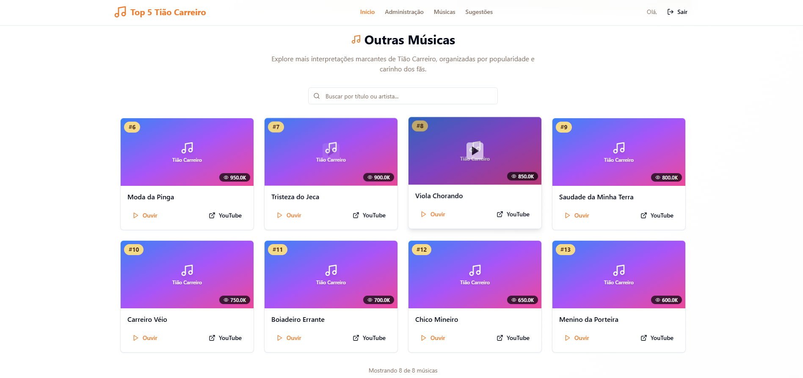
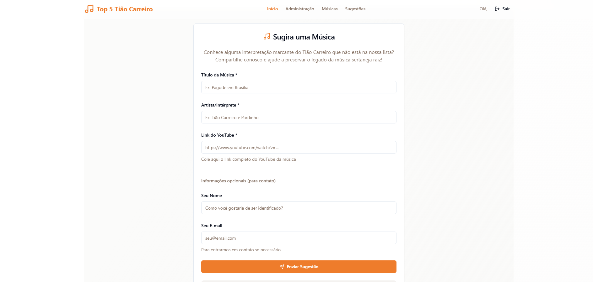
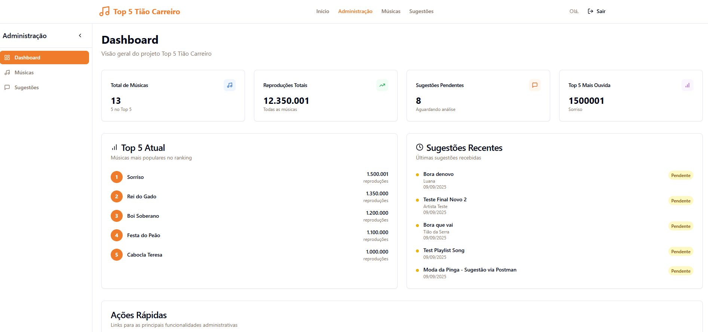
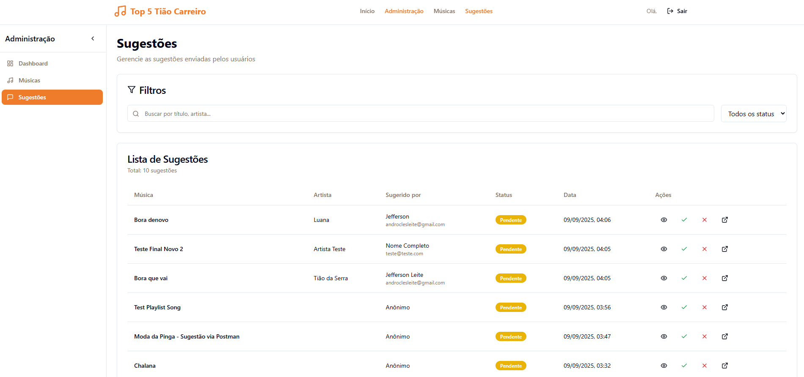

# 🎵 Top 5 Tião Carreiro & Pardinho

Sistema web para ranking das melhores músicas de Tião Carreiro, com interface administrativa e sugestões de usuários.

## 🚀 Como Executar

### 1. Comando único:
```bash
docker-compose up -d
```

### 2. URLs de Acesso:
- **Frontend (Sistema)**: http://localhost:3000
- **Backend API**: http://localhost:8000/api/v1
- **PHPMyAdmin**: http://localhost:8080
- **Portainer**: http://localhost:9000

### 3. Credenciais:

**Login Admin:**
- Email: `admin@techpines.com.br`  
- Senha: `password123`

**PHPMyAdmin:**
- Servidor: `mysql`
- Usuário: `laravel`
- Senha: `password`

---

## ⚡ O Sistema

### Funcionalidades Principais:
- ✅ Top 5 músicas com sistema de posicionamento
- ✅ Sugestões de usuários com aprovação admin
- ✅ Links diretos para YouTube
- ✅ Painel administrativo completo
- ✅ API RESTful com autenticação Sanctum
- ✅ Busca e filtros avançados

### Tecnologias:
- **Backend**: Laravel 11 + MySQL + Redis
- **Frontend**: React + TypeScript + Tailwind CSS
- **Container**: Docker + Apache

---

## 📱 Screenshots do Sistema

### Home Page





### Painel Administrativo


### Página de Sugestões


---

## 🔧 Comandos Úteis

```bash
# Parar containers
docker-compose down

# Ver logs do sistema
docker-compose logs backend
docker-compose logs frontend

# Rebuild se mudou código
docker-compose up -d --build

# Reset completo (apaga banco)
docker-compose down -v && docker-compose up -d
```

## 🧪 Testar API

1. Use o arquivo `backend/POSTMAN.md` com todas as rotas ou importe: Postman_Collection.json
2. Faça login para obter token de autenticação
3. Teste endpoints protegidos com o token

---

**✅ Tudo funciona automaticamente após o `docker-compose up -d`**


